# CourseInside - Kurs Satış Sistemi
Bu proje, basit bir kurs satış sistemi örneği içermektedir. **API** için ".NET 8.0" **Arayüz** için "React" Kullanılmıştır.

## Sistem'in Mimarisi

```mermaid
flowchart TB
    subgraph React
    UI["React Components"]
    ContextAPI["React Context API 
    (State Management)"]
    UI --> ContextAPI
    end

    subgraph API
    Controller["ASP.NET Core Controllers (JWT Auth)"]
    ServiceLayer["Service Layer 
    (Business Logic)"]
    RepositoryLayer["Repository Layer"]
    end

    subgraph Infra
    DB["MSSQL Database"]
    Cache["MemoryCache"]
    end

    UI -->|Axios + JWT Bearer| Controller
    Controller --> ServiceLayer
    ServiceLayer --> Cache
    ServiceLayer --> RepositoryLayer
    RepositoryLayer --> DB
    ContextAPI -->|Kullanıcı + Token Bilgisi| UI
``` 



# API Endpoint Kullanımları

## 1. Kullanıcı Yönetimi

### 1.1 Kayıt Ol
**Uç Nokta:** `POST /api/User/register`  
**Gerekli Rol:** Yok (Anonim Erişim)

**İstek Formatı:**
```json
POST /api/User/register
Content-Type: application/json

{
  "email": "yeniuser@example.com",
  "name": "Yeni Kullanıcı",
  "password": "Yeni123!"
}
```

**Örnek Yanıt:**
```
Kullanıcı başarıyla kaydedildi
```

---

### 1.2 Giriş Yap
**Uç Nokta:** `POST /api/User/login`  
**Gerekli Rol:** Yok (Anonim Erişim)  

**İstek Formatı:**
```json
POST /api/User/login
Content-Type: application/json

{
  "email": "admin@example.com",
  "password": "admin123"
}
```

**Örnek Yanıt:**
```json
{
  "token": "eyJhbGciOiJI...",
  "role": "Admin"
}
```
**Not:** Bu token, diğer isteklerde `Authorization: Bearer {token}` olarak kullanılmalıdır.

---

### 1.3 Şifre Sıfırla
**Uç Nokta:** `POST /api/User/reset-password`  
**Gerekli Rol:** Yok (Anonim Erişim)  

**İstek Formatı:**
```json
POST /api/User/reset-password
Content-Type: application/json

{
  "email": "user@example.com",
  "newPassword": "Yeni123!"
}
```

**Örnek Yanıt:**
```
Şifre başarıyla sıfırlandı
```

---

### 1.4 Profil Bilgilerini Getir
**Uç Nokta:** `GET /api/User/profile`  
**Gerekli Rol:** Kimliği Doğrulanmış Kullanıcı (JWT Zorunlu)  

**İstek Formatı:**
```json
GET /api/User/profile
Authorization: Bearer {token}
```

**Örnek Yanıt:**
```json
{
  "userId": "a1b2c3d4",
  "email": "user@example.com",
  "name": "Normal Kullanıcı",
  "role": "User",
  "purchasedCourses": [
    {
      "orderId": 10,
      "courseTitle": "React ile Web Geliştirme",
      "purchaseDate": "2025-01-05T12:34:56"
    }
  ]
}
```

---

### 1.5 Profil Güncelle
**Uç Nokta:** `PUT /api/User/{id}`  
**Gerekli Rol:**
- Admin: Herkesi güncelleyebilir.
- Normal Kullanıcı: Sadece kendi profilini güncelleyebilir.

**İstek Formatı:**
```json
PUT /api/User/{id}
Authorization: Bearer {token}
Content-Type: application/json

{
  "email": "guncellenmis@example.com",
  "name": "Güncellenmiş Kullanıcı",
  "oldPassword": "Eski123!",
  "newPassword": "Yeni123!"
}
```

**Örnek Yanıt:**
```
Kullanıcı başarıyla güncellendi
```
**Not:** `oldPassword` ve `newPassword` sağlanırsa, şifre değiştirilir.

---

## 2. Kurs Yönetimi

### 2.1 Tüm Kursları Listele
**Uç Nokta:** `GET /api/Course`  
**Gerekli Rol:** Yok (Anonim Erişim)  

**İstek Formatı:**
```json
GET /api/Course
```

**Örnek Yanıt:**
```json
[
  {
    "id": 1,
    "title": "React ile Web Geliştirme",
    "description": "React'i sıfırdan ileri seviyeye öğrenin",
    "price": 149.99,
    "category": "Teknoloji"
  },
  {
    "id": 2,
    "title": "C# ile Backend Geliştirme",
    "description": "...",
    "price": 129.99,
    "category": "Teknoloji"
  }
]
```

---

### 2.2 Kurs Ara
**Uç Nokta:** `GET /api/Course/search`  
**Gerekli Rol:** Yok (Anonim Erişim)  

**İstek Formatı:**
```json
GET /api/Course/search?keyword=react&pageNumber=1&pageSize=3
```

**Örnek Yanıt:**
```json
{
  "items": [
    {
      "id": 1,
      "title": "React ile Web Geliştirme",
      "description": "React'i sıfırdan ileri seviyeye öğrenin",
      "price": 149.99,
      "category": "Teknoloji"
    }
  ],
  "pageNumber": 1,
  "pageSize": 3,
  "totalCount": 1
}
```

---

### 2.3 Kurs Ekle
**Uç Nokta:** `POST /api/Course`  
**Gerekli Rol:** Admin  

**İstek Formatı:**
```json
POST /api/Course
Authorization: Bearer {token}
Content-Type: application/json

{
  "title": "Yeni Kurs",
  "description": "Detaylı anlatım...",
  "price": 99.99,
  "category": "Teknoloji"
}
```

**Örnek Yanıt:**
```
Kurs başarıyla eklendi
```

---

## 3. Sipariş Yönetimi

### 3.1 Kurs Satın Al
**Uç Nokta:** `POST /api/Order/buy`  
**Gerekli Rol:** Kimliği Doğrulanmış Kullanıcı  

**İstek Formatı:**
```json
POST /api/Order/buy
Authorization: Bearer {token}
Content-Type: application/json

{
  "courseId": 3
}
```

**Örnek Yanıt:**
```
Kurs başarıyla satın alındı
```

---

Bu dökümantasyon, CourseInside platformundaki kullanıcı, kurs, sipariş ve ödeme işlemlerini yönetmek için gerekli olan API uç noktalarının kapsamlı bir özetini sunar. Gerektiğinde ek uç noktalar ve detaylar eklenebilir.


