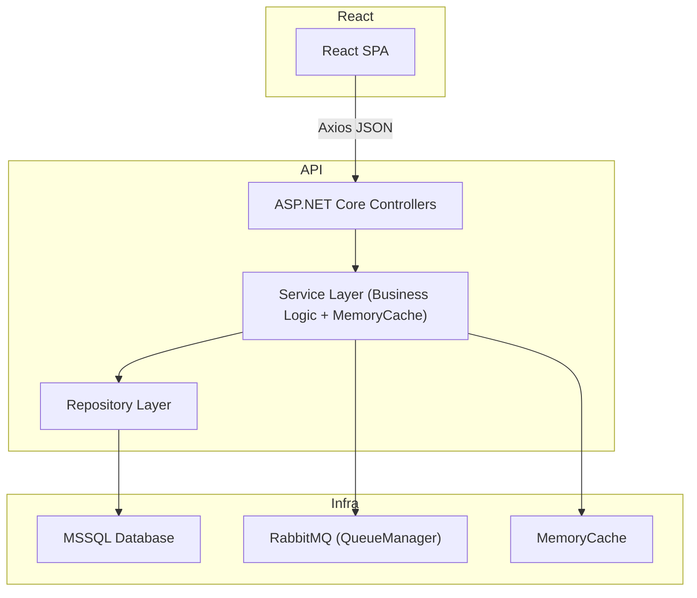

# CourseInside - Kurs Satış Sistemi
Bu proje, basit bir kurs satış sistemi örneği içermektedir. **API** için ".NET 8.0" **Arayüz** için "React" Kullanılmıştır.

## Sistem'in Mimarisi

## API Uç Noktaları

### Kullanıcı Yönetimi

#### POST /api/User/register
Örnek İstek: 
{
  "email": "newuser@example.com",
  "name": "New User",
  "password": "New123!"
}
Örnek Yanıt: "User registered successfully."

#### POST /api/User/login
Örnek İstek: 
{
  "email": "user@example.com",
  "password": "user123"
}

Örnek Yanıt: 
{
  "token": "eyJhbGciOiJI...",
  "role": "User"
}

#### POST /api/User/reset-password
Örnek İstek: 
{
  "email": "user@example.com",
  "newPassword": "MyNewPassword1!"
}

Örnek Yanıt: "Password reset successfully"

#### GET /api/User/profile
Header: Authorization: Bearer {token}
Örnek Yanıt: 
{
  "userId": "some-guid",
  "email": "user@example.com",
  "name": "User Name",
  "role": "User",
  "purchasedCourses": [
    {
      "orderId": 10,
      "courseTitle": "React ile Web Geliştirme",
      "purchaseDate": "2023-10-01T13:45:00Z"
    }
  ]
}

#### PUT /api/User/{id}
Header: Authorization: Bearer {token}
Örnek İstek: 
{
  "email": "updated@example.com",
  "name": "Updated Name",
  "oldPassword": "user123",
  "newPassword": "User1234New"
}

Örnek Yanıt: "User updated successfully."

### Kurs Yönetimi

#### GET /api/Course
Örnek Yanıt: 
[
  {
    "id": 1,
    "title": "React ile Web Geliştirme",
    "description": "React'i sıfırdan ileri seviyeye öğrenin",
    "price": 149.99,
    "category": "Teknoloji"
  }
]

#### GET /api/Course/search?keyword=react&pageNumber=1&pageSize=6
Örnek Yanıt:
{
  "items": [
    {
      "id": 1,
      "title": "React ile Web Geliştirme",
      "description": "React'i sıfırdan ileri seviyeye öğrenin",
      "price": 149.99,
      "category": "Teknoloji"
    }
  ],
  "pageNumber": 1,
  "pageSize": 3,
  "totalCount": 1
}

#### GET /api/Course/{id}
{
  "id": 1,
  "title": "React ile Web Geliştirme",
  "description": "React'i sıfırdan ileri seviyeye öğrenin",
  "price": 149.99,
  "category": "Teknoloji"
}

### Sipariş / Order

#### GET /api/Order
Header: Authorization: Bearer {token}
Örnek Yanıt:
[
  {
    "id": 10,
    "userId": "some-guid",
    "courseId": 1,
    "orderDate": "2023-10-01T13:45:00",
    "payment": {
      "id": 15,
      "orderId": 10,
      "amount": 149.99,
      "paymentStatus": "Completed",
      "paymentDate": "2023-10-01T13:46:00"
    },
    "user": {
      "id": "some-guid",
      "email": "user@example.com",
      "passwordHash": "hashed123",
      "name": "User Name",
      "role": "User",
      "orders": []
    },
    "course": {
      "id": 1,
      "title": "React ile Web Geliştirme",
      "description": "React'i sıfırdan ileri seviyeye öğrenin",
      "price": 149.99,
      "category": "Teknoloji"
    }
  }
]

#### GET /api/Order/{id}
Belirli sipariş detayı. önceki ile aynı yapı

#### POST /api/Order/buy
Örnek İstek:
{
  "courseId": 3
}

### Ödeme / Payment

#### GET /api/Payment
Tüm ödemeleri listeler (admin).

#### GET /api/Payment/{id}
Tek ödeme detayı.

## Kurulum
1. ASP.Net Core API (.Net 8.0)
2. React
3. MSSQL
4. http://localhost:3000 (React), http://localhost:5000 (API)
5. Server=localhost\\SQLEXPRESS;Database=CourseInsideDB;Trusted_Connection=True;TrustServerCertificate=True (MSSQL)

